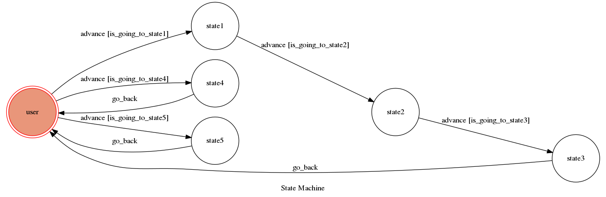

# TOC Project 2017
這是一個模擬 BotFather 的陽春聊天機器人，並不會真的產生聊天機器人，所以可以盡情的 new bot。
## Setup
確認已安裝 python3 最新版
### Secret Data
API_TOKEN and WEBHOOK_URL in app.py MUST be set to proper values.
### Run Locally
```sh
ngrok http 5000
```
### Run the sever
```sh
python3 app.py
```
## Finite State Machine

## Usage
初始狀態 `user` ，總共5有個 state 。

* user
    * Input: "/start"
    
        * Reply: "I can help you create and manage Telegram bots. If you're new to the Bot API, please see the manual.
		You can control me by sending these commands:
		/newbot - create a new bot
		/mybots - show your bots"
		* Input: "/newbot"
        * Reply: "Alright, a new bot. How are we going to 			call it? Please choose a name for your bot."
            * Input: "<想取的名字>"
                * Reply: "Good. Now let's choose a username 		for your bot. It must end in "bot". 		Like this, for example: TetrisBot or 		tetris_bot."
                    * Input: "<想取的名字>"
                        * Reply: "Done! Congratulations on 			your new bot."
    * Input: "/mybots"
        * Reply: "Your bots: ...(所有輸入的名字)"
